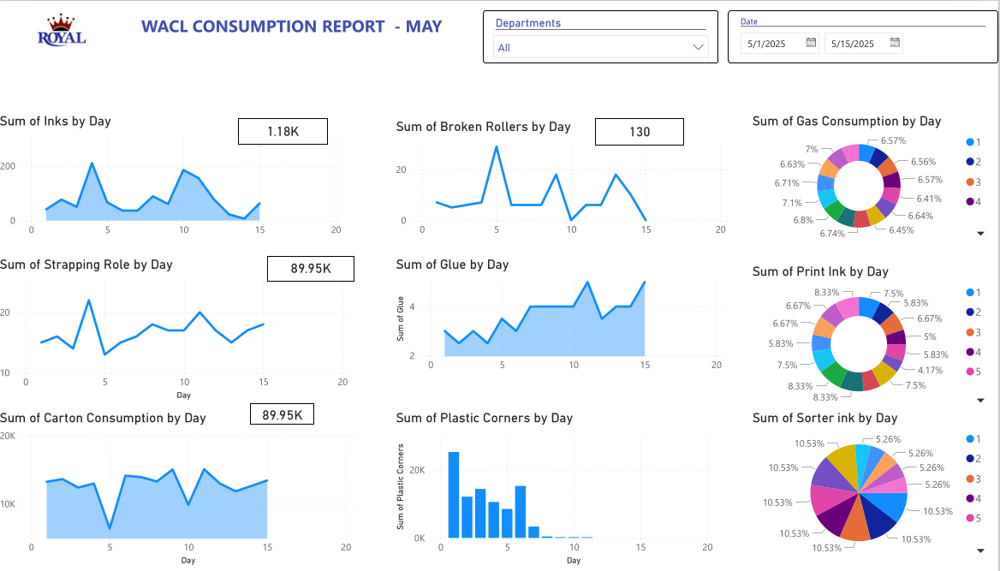
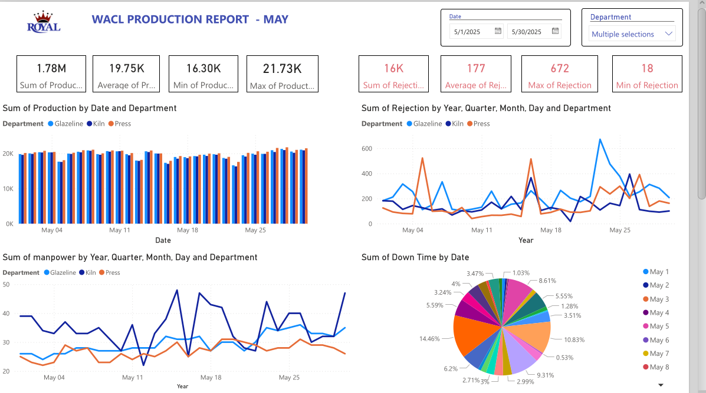

# Production Performance & KPI Dashboard (Power BI)

## 📌 Project Overview
This project involved developing a comprehensive analytical dashboard to track and visualize key production drivers at **West African Ceramic Limited**. By loading data from the **Orion ERP system**, the dashboard provides real-time analysis into manufacturing efficiency, downtime, and quality control.

## 🛠️ Tech Stack & Skills
- **Power BI:** Data Modeling, DAX (Data Analysis Expressions), and Report Design.
- **Excel:** Data cleaning, removing duplicates, and handling null values from messy production logs.
- **Manufacturing Domain Knowledge:** Understanding Rejection Rates, Downtime Analysis, and Manpower Efficiency.

## 📊 Key Features & KPIs Tracked
- **Total Output vs. Target:** Visualizing production gaps.
- **Downtime Analysis:** Categorizing downtime by department. to highlight department which require increased efficiency
- **Rejection Rates:** Tracking quality control issues per production line.
- **Manpower Utilization:** Correlating staff presence with total daily output.

## 📈 Business Impact
- **Faster Decision Making:** Provided department heads with live visibility, allowing for immediate intervention when rejection rates spiked.
- **Improved Accuracy:** Eliminated manual entry errors by 20% through direct ERP data integration.

## 🖼️ Dashboard Preview

